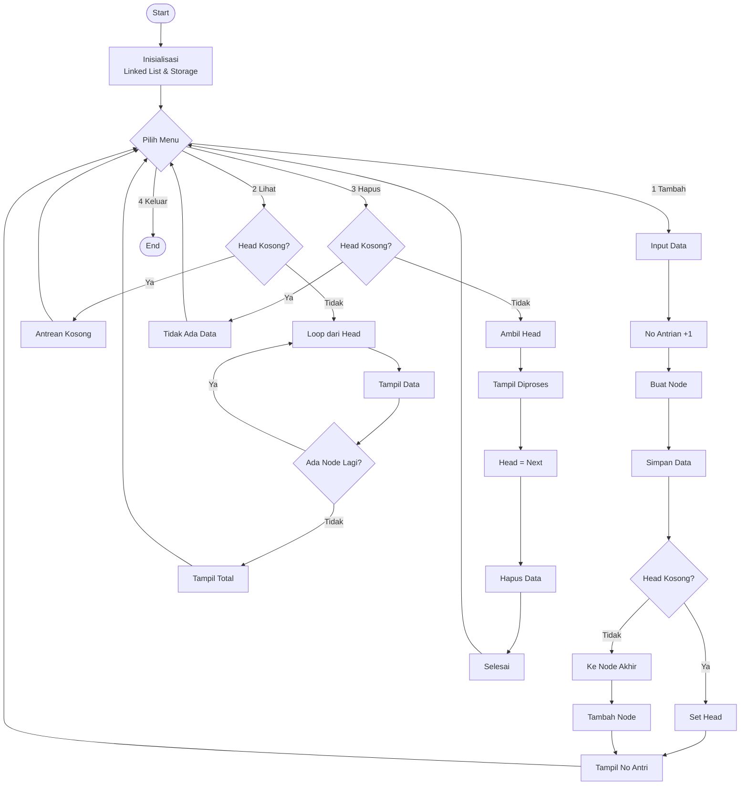

## 👥 Identitas Kelompok

- Nama dan NIM :
  
        1 . Cherie Hannanya Limpele      |  2501010047
        2 . Wilsa Dwi Amelia Hastiawan   |  2501010009
- Kelas         :   A / Informatika
- Mata Kuliah   :   Struktur Data
  
---

# Pendahuluan

Perkembangan teknologi informasi saat ini mendorong berbagai aktivitas yang sebelumnya dilakukan secara manual menjadi lebih terstruktur dan terkomputerisasi, termasuk dalam pengelolaan data dan antrean. Salah satu contoh yang sering ditemui adalah sistem peminjaman buku di perpustakaan, di mana mahasiswa harus menunggu giliran untuk dilayani. Jika tidak dikelola dengan baik, proses antrean ini dapat menimbulkan ketidakteraturan dan ketidakadilan dalam pelayanan.

Dalam ilmu struktur data, terdapat konsep queue (FIFO) yang dapat digunakan untuk mengatasi permasalahan antrean tersebut. Konsep ini bekerja dengan prinsip First In First Out, yaitu data yang pertama masuk akan diproses terlebih dahulu. Dengan menerapkan konsep ini, sistem antrean dapat berjalan lebih teratur dan sesuai dengan kondisi nyata yang terjadi di lingkungan perpustakaan.

Selain itu, pemilihan struktur data juga menjadi hal yang penting dalam implementasi sistem. Pada proyek ini, digunakan linked list sebagai struktur data untuk menyimpan antrean. Linked list dipilih karena memiliki sifat dinamis dan tidak memiliki batas kapasitas tetap seperti array, sehingga lebih fleksibel dalam mengelola data yang terus bertambah atau berkurang.

Berdasarkan hal tersebut, pada proyek ini akan dibangun sebuah sistem antrean peminjaman buku berbasis queue dengan implementasi linked list. Sistem ini diharapkan dapat membantu dalam memahami penerapan konsep struktur data secara nyata, serta memberikan gambaran sederhana mengenai bagaimana proses antrean dapat dikelola secara lebih efektif dan terstruktur.

---

# Rumusan Masalah

1. Bagaimana penerapan konsep queue (FIFO) dapat digunakan untuk mengelola antrean peminjaman buku secara adil, terstruktur, dan sesuai dengan kondisi nyata di perpustakaan?
   
2. Bagaimana efektivitas penggunaan linked list dibandingkan dengan array dalam mengelola antrean peminjaman buku, khususnya dalam hal fleksibilitas dan efisiensi pengolahan data?
   
3. Bagaimana sistem antrean yang dibuat dapat menggabungkan proses pengelolaan data peminjaman dengan mekanisme antrean sehingga bisa mendekati kondisi nyata di perpustakaan?
   
---

# Solusi yang Ditawarkan

Sistem yang dibangun dalam proyek ini menerapkan konsep queue (FIFO) untuk mengelola antrean peminjaman buku secara terstruktur dan adil, di mana mahasiswa yang melakukan peminjaman lebih awal akan dilayani terlebih dahulu. Dengan cara ini, proses antrean menjadi lebih tertib dan sesuai dengan kondisi yang biasanya terjadi di perpustakaan.

Dalam implementasinya, digunakan struktur data linked list sebagai media penyimpanan antrean. Pemilihan linked list didasarkan pada kemampuannya dalam mengelola data secara dinamis tanpa batas kapasitas tetap, berbeda dengan array yang memiliki ukuran terbatas. Selain itu, proses penambahan dan penghapusan data bisa dilakukan tanpa harus menggeser elemen lain, sehingga lebih efisien untuk digunakan dalam sistem antrean.

Melalui kombinasi antara queue dan linked list, sistem ini tidak hanya berfungsi untuk mengatur urutan antrean, tetapi juga mampu menyimpan data peminjaman seperti identitas mahasiswa, data buku, serta tanggal peminjaman dan pengembalian. Hal ini menjadikan sistem yang dibangun tidak hanya berfungsi sebagai simulasi antrean, tetapi juga sebagai representasi sederhana dari sistem administrasi peminjaman buku di perpustakaan.

---

# Landasan Teori

## 1. Pengertian Struktur Data

Struktur data merupakan cara untuk menyimpan, mengorganisasikan, dan mengatur data di dalam komputer agar dapat digunakan secara efisien. Data sendiri adalah fakta mentah yang belum memiliki arti, namun dapat diolah menjadi informasi yang berguna dalam sistem komputer (Zakaria & Prijono, 2006; A.S & Shalahuddin, 2016). Menurut Romney & Steinbart (2014), data merupakan fakta yang dikumpulkan, disimpan, dan diproses oleh sistem informasi untuk menghasilkan informasi yang bermanfaat.

Struktur data juga dapat dipahami sebagai bentuk abstraksi atau model yang digunakan untuk mengatur data di dalam memori komputer. Setyaningsih (2012) dan Ikhwan et al. (2015) menjelaskan bahwa struktur data merupakan susunan data dalam memori (RAM) yang dapat memiliki berbagai tipe data dalam satu sistem. Selain itu, struktur data juga menggambarkan hubungan antar data secara logis sehingga lebih mudah dipahami dan digunakan dalam pemrograman.

Lebih lanjut, Kadir (2021) menjelaskan bahwa struktur data adalah cara merepresentasikan data dalam media penyimpanan komputer agar dapat digunakan kembali dengan mudah. Struktur data terdiri dari tiga komponen utama, yaitu kumpulan objek data, operasi terhadap objek data, dan hubungan antar objek data. Dengan pemilihan struktur data yang tepat, permasalahan dalam pemrograman dapat diselesaikan lebih efisien karena penggunaan memori dan waktu eksekusi menjadi lebih optimal.

## 📚 Sumber Ilmiah 
- A.S, Rosa & Shalahuddin, M. (2016). Rekayasa Perangkat Lunak Terstruktur dan Berorientasi Objek. Informatika.
- Ikhwan, A., et al. (2015). Struktur Data dan Algoritma. Modul/Buku Ajar.
- Kadir, A. (2021). Dasar Perancangan dan Implementasi Database Relasional. Andi.
- Romney, M. B., & Steinbart, P. J. (2014). Sistem Informasi Akuntansi. Pearson.
- Setyaningsih. (2012). Struktur Data. Modul/Buku Ajar.
- Zakaria, T. M., & Prijono, A. (2006). Konsep dan Implementasi Struktur Data. Informatika.

## 2. Konsep Queue

Queue atau antrian merupakan salah satu struktur data linear yang menerapkan prinsip First In First Out (FIFO), yaitu elemen yang pertama masuk akan menjadi elemen yang pertama keluar. Konsep queue digunakan untuk mengatur data secara berurutan agar proses pengolahan data menjadi lebih sistematis dan efisien. Menurut Trijayanti et al. (2025), queue merupakan struktur data yang banyak digunakan dalam sistem penjadwalan proses pada sistem operasi untuk mengelola antrian proses secara teratur. Selain itu, Aho, Hopcroft, & Ullman (1983) menjelaskan bahwa queue termasuk struktur data linear yang sangat penting dalam pengaturan urutan data dalam pemrograman komputer.

Dalam sistem komputer, queue memiliki peran penting dalam pengelolaan proses, terutama pada sistem operasi. Struktur ini digunakan untuk mengatur proses yang masuk ke CPU berdasarkan urutan kedatangan sehingga setiap proses mendapatkan kesempatan eksekusi secara adil. Hal ini bertujuan untuk meningkatkan efisiensi sistem dan mengurangi waktu tunggu proses. Menurut Goodrich & Tamassia (2014), queue juga sering digunakan dalam berbagai aplikasi komputasi seperti manajemen antrian, pengolahan data, dan algoritma pemrosesan berurutan yang membutuhkan keteraturan dalam eksekusi data.

Queue memiliki dua operasi utama, yaitu enqueue dan dequeue. Enqueue digunakan untuk menambahkan elemen ke bagian belakang antrian, sedangkan dequeue digunakan untuk menghapus elemen dari bagian depan antrian. Kedua operasi ini berjalan sesuai prinsip FIFO sehingga urutan data tetap terjaga. Cormen et al. (2009) menjelaskan bahwa operasi pada queue dirancang untuk memastikan efisiensi dalam pengelolaan data berurutan. Dengan demikian, implementasi queue seperti yang dijelaskan oleh Trijayanti et al. (2025) sangat efektif digunakan dalam sistem penjadwalan proses karena mampu mengatur alur data secara terstruktur dan efisien.

## 📚 Sumber Ilmiah 
- Trijayanti, A., Aulia, I., Khairunisa, N., Purba, F. A. H., & Gunawan, I. (2025). Implementasi Struktur Data Antrian Queue dalam Sistem Penjadwalan Proses pada Sistem Operasi. Jurnal Publikasi Teknik Informatika, 4(2), 48–53. 
- Aho, A. V., Hopcroft, J. E., & Ullman, J. D. (1983). Data Structures and Algorithms. Addison-Wesley.
- Cormen, T. H., Leiserson, C. E., Rivest, R. L., & Stein, C. (2009). Introduction to Algorithms (3rd ed.). MIT Press.
- Goodrich, M. T., & Tamassia, R. (2014). Data Structures and Algorithms in Java (6th ed.). Wiley.

## 3. Konsep FIFO

Algoritma First In First Out (FIFO) merupakan metode penjadwalan sederhana yang banyak digunakan dalam sistem antrean (queueing system) dan sistem operasi. Prinsip utama FIFO adalah proses atau entitas yang pertama kali datang akan dilayani terlebih dahulu, tanpa mempertimbangkan prioritas tertentu. Dalam konteks sistem operasi, FIFO dikenal juga sebagai First Come First Served (FCFS), di mana setiap proses dieksekusi berdasarkan urutan kedatangannya (arrival time) dan akan dijalankan hingga selesai sebelum proses berikutnya dimulai (Silberschatz, Galvin, & Gagne, 2020; Stallings, 2018). Konsep ini menjadikan FIFO sebagai metode dasar dalam memahami mekanisme penjadwalan proses pada CPU.

Dalam implementasinya, FIFO bekerja dengan memperhatikan beberapa parameter penting seperti arrival time, burst time, waiting time, dan turn around time. Proses yang datang lebih awal akan masuk ke antrian dan dieksekusi terlebih dahulu, sehingga urutan eksekusi bersifat linear dan tidak memiliki mekanisme prioritas (non-preemptive). Menurut Kleinrock (1975), FIFO merupakan bentuk paling dasar dari queueing discipline yang digunakan untuk menggambarkan sistem antrean dalam teori antrian. Selain itu, Gross et al. (2023) menjelaskan bahwa FIFO juga menjadi dasar dalam model sistem antrean seperti M/M/1 yang menggambarkan hubungan antara laju kedatangan dan waktu pelayanan dalam suatu sistem.

Selain digunakan dalam sistem operasi, FIFO juga banyak diterapkan dalam berbagai bidang seperti manajemen persediaan barang, jaringan komputer, dan sistem pelayanan. Dalam industri, FIFO digunakan untuk memastikan barang yang lebih dahulu masuk akan lebih dahulu keluar guna menghindari risiko kedaluwarsa (Sohrabi et al., 2021). Pada sistem jaringan, FIFO digunakan untuk mengatur antrian paket data agar diproses sesuai urutan kedatangan (Attar et al., 2020). Dengan demikian, FIFO tidak hanya berfungsi sebagai konsep dasar dalam teori penjadwalan proses, tetapi juga menjadi fondasi penting dalam berbagai sistem komputasi dan industri modern karena kesederhanaan dan keadilannya dalam pengelolaan antrian.

## 📚 Sumber Ilmiah 
- Attar, H., Hashim, S., & Diko, I. (2020). Review and performance evaluation of FIFO, PQ, CQ, FQ, WFQ, and CBWFQ queue scheduling mechanisms. International Journal of Engineering Research and Technology, 9(3), 112–118.
- Gross, D., Shortle, J. F., Thompson, J. M., & Harris, C. M. (2023). Fundamentals of queueing theory (6th ed.). Wiley.
- Kleinrock, L. (1975). Queueing systems, volume I: Theory. Wiley-Interscience.
- Silberschatz, A., Galvin, P. B., & Gagne, G. (2020). Operating system concepts (10th ed.). Wiley.
- Sohrabi, M., Baygi, S. F., & Rezaei, M. (2021). A simple empirical inventory model using FIFO for managing material expiry. BMC Health Services Research, 21(5), 145–157.
- Stallings, W. (2018). Operating systems: Internals and design principles (9th ed.). Pearson.

## 4. Implementasi Menggunakan Linked List

Linked list merupakan struktur data linear yang digunakan untuk menyimpan data dalam bentuk node yang saling terhubung. Setiap node terdiri dari data dan pointer yang menunjuk ke node berikutnya. Struktur ini bersifat dinamis karena tidak memiliki ukuran tetap seperti array. Hal ini menjadikan linked list lebih fleksibel dalam pengelolaan data (Carrano, 2013; Lipschutz, 2009; Tremblay & Sorenson, 1984).

Dalam implementasinya, linked list memungkinkan proses penambahan dan penghapusan data dilakukan tanpa perlu menggeser elemen lain. Hal ini menjadi keunggulan utama dibandingkan dengan array. Efisiensi ini sangat berguna dalam sistem yang sering mengalami perubahan data. Oleh karena itu, linked list sering digunakan dalam berbagai aplikasi struktur data (Lipschutz, 2009; Tremblay & Sorenson, 1984; Carrano, 2013).

Linked list juga dapat digunakan dalam implementasi queue dengan menambahkan data di bagian belakang dan menghapus data dari bagian depan. Hal ini sesuai dengan prinsip FIFO yang digunakan dalam queue. Dengan demikian, linked list dapat mendukung sistem antrean secara optimal. Selain itu, linked list mampu menangani jumlah data yang dinamis (Carrano, 2013; Tremblay & Sorenson, 1984; Lipschutz, 2009).

## 📚 Sumber Ilmiah 
- Carrano, F. M. (2013). Data Abstraction and Problem Solving with C++.
- Lipschutz, S. (2009). Data Structures. Schaum’s Outline.
- Tremblay, J. P., & Sorenson, P. G. (1984). An Introduction to Data Structures with Applications.
  
---

# Desain Sistem dan Implementasi

# Penjelasan Alur Flowchart

Flowchart pada sistem ini menggambarkan alur kerja program antrean peminjaman buku di perpustakaan yang dibangun menggunakan konsep queue (FIFO) dengan implementasi linked list. Program dimulai dari proses inisialisasi, di mana sistem membuat struktur antrean berupa linked list yang masih kosong, serta menyiapkan struktur tambahan berupa list (storage) untuk menyimpan data secara terpisah, dan variabel total antrean sebagai penomoran otomatis.

Setelah proses inisialisasi, sistem menampilkan menu utama yang terdiri dari beberapa pilihan, yaitu menambah data peminjaman, menampilkan data antrean, menghapus data berdasarkan FIFO, dan keluar dari program. Pengguna memilih salah satu menu, kemudian sistem akan menjalankan proses sesuai dengan pilihan tersebut dan kembali ke menu utama selama program masih berjalan.

Pada saat pengguna memilih menu tambah data, sistem akan menerima input data peminjaman seperti ID peminjaman, ID buku, nama, NIM, program studi, judul buku, tahun terbit, tanggal pinjam, dan tanggal kembali. Setelah itu, sistem akan menambahkan nomor antrean secara otomatis dengan meningkatkan nilai total antrean. Data tersebut kemudian dibentuk menjadi sebuah node baru. Node ini akan disimpan ke dalam storage list, lalu dimasukkan ke dalam linked list. Jika antrean masih kosong, node akan menjadi head. Namun jika sudah terdapat data sebelumnya, sistem akan melakukan penelusuran dari head hingga node terakhir menggunakan proses iterasi, kemudian menghubungkan node baru di bagian akhir antrean.

Pada menu lihat data, sistem akan mengecek apakah antrean kosong atau tidak. Jika kosong, sistem menampilkan pesan bahwa belum ada data peminjaman. Jika terdapat data, sistem akan melakukan penelusuran node satu per satu mulai dari head hingga akhir, lalu menampilkan informasi seperti nomor antrean, ID peminjaman, NIM, nama, dan judul buku. Setelah seluruh data ditampilkan, sistem juga menampilkan total jumlah transaksi peminjaman yang telah dilakukan.

Pada menu hapus data (FIFO), sistem kembali melakukan pengecekan apakah antrean kosong. Jika kosong, sistem menampilkan pesan bahwa tidak ada data yang dapat diproses. Jika terdapat data, maka node yang berada di posisi paling depan (head) akan diambil sebagai data yang diproses terlebih dahulu sesuai prinsip FIFO. Data tersebut ditampilkan sebagai informasi peminjaman yang sedang diselesaikan. Selanjutnya, posisi head akan dipindahkan ke node berikutnya sehingga data pertama terhapus dari antrean. Selain itu, elemen pertama pada storage list juga dihapus untuk menjaga konsistensi data antara kedua struktur.

Proses ini akan terus berulang hingga pengguna memilih menu keluar. Ketika pengguna memilih menu keluar, program akan dihentikan dan seluruh proses berakhir. Dengan alur tersebut, sistem mampu merepresentasikan mekanisme antrean peminjaman buku secara terstruktur, adil, dan sesuai dengan kondisi nyata di perpustakaan.

# Kesimpulan

Berdasarkan hasil perancangan dan implementasi sistem antrean peminjaman buku menggunakan konsep queue (FIFO) dengan struktur data linked list, dapat disimpulkan bahwa rumusan masalah yang telah dirumuskan sebelumnya berhasil dijawab dengan baik. Penerapan konsep queue terbukti mampu mengelola antrean peminjaman secara adil dan terstruktur, di mana setiap peminjam dilayani berdasarkan urutan kedatangan. Selain itu, penggunaan linked list memberikan fleksibilitas dalam pengelolaan data dibandingkan array, terutama dalam proses penambahan dan penghapusan data tanpa perlu melakukan pergeseran elemen.

Dari sisi kesesuaian dengan teori, sistem yang dibangun telah berjalan sesuai dengan konsep dasar queue dan prinsip FIFO. Hal ini terlihat dari mekanisme enqueue yang menambahkan data di bagian belakang antrean serta dequeue yang menghapus data dari bagian depan antrean. Implementasi linked list juga telah mendukung proses tersebut secara dinamis, sehingga sistem mampu merepresentasikan teori struktur data ke dalam bentuk aplikasi sederhana yang dapat dijalankan.

Adapun manfaat penggunaan queue dalam kasus ini dapat dirasakan secara langsung dalam pengelolaan antrean peminjaman buku. Sistem menjadi lebih teratur, transparan, dan mudah dipahami karena setiap proses berjalan berdasarkan urutan yang jelas. Selain itu, penggunaan queue juga membantu menghindari ketidakteraturan dalam pelayanan, sehingga proses peminjaman menjadi lebih efisien dan mendekati kondisi nyata yang terjadi di perpustakaan. Dengan demikian, sistem yang dibangun tidak hanya berfungsi sebagai simulasi, tetapi juga memberikan gambaran praktis mengenai penerapan struktur data dalam kehidupan sehari-hari.
