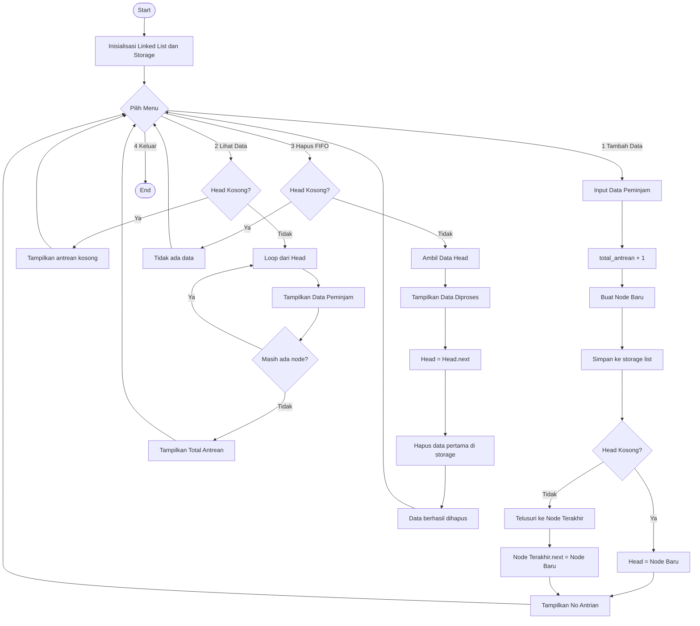

## 👥 Identitas Kelompok

- Nama dan NIM :
  
        1 . Cherie Hannanya Limpele      |  2501010047
        2 . Wilsa Dwi Amelia Hastiawan   |  2501010009
- Kelas         :   A / Informatika
- Mata Kuliah   :   Struktur Data
  
---

# Pendahuluan

Perkembangan teknologi informasi saat ini mendorong berbagai aktivitas yang sebelumnya dilakukan secara manual menjadi lebih terstruktur dan terkomputerisasi, termasuk dalam pengelolaan data dan antrean. Salah satu contoh yang sering ditemui adalah sistem peminjaman buku di perpustakaan, di mana mahasiswa harus menunggu giliran untuk dilayani. Jika tidak dikelola dengan baik, proses antrean ini dapat menimbulkan ketidakteraturan dan ketidakadilan dalam pelayanan.

Dalam ilmu struktur data, terdapat konsep queue (FIFO) yang dapat digunakan untuk mengatasi permasalahan antrean tersebut. Konsep ini bekerja dengan prinsip First In First Out, yaitu data yang pertama masuk akan diproses terlebih dahulu. Dengan menerapkan konsep ini, sistem antrean dapat berjalan lebih teratur dan sesuai dengan kondisi nyata yang terjadi di lingkungan perpustakaan.

Selain itu, pemilihan struktur data juga menjadi hal yang penting dalam implementasi sistem. Pada proyek ini, digunakan linked list sebagai struktur data untuk menyimpan antrean. Linked list dipilih karena memiliki sifat dinamis dan tidak memiliki batas kapasitas tetap seperti array, sehingga lebih fleksibel dalam mengelola data yang terus bertambah atau berkurang.

Berdasarkan hal tersebut, pada proyek ini akan dibangun sebuah sistem antrean peminjaman buku berbasis queue dengan implementasi linked list. Sistem ini diharapkan dapat membantu dalam memahami penerapan konsep struktur data secara nyata, serta memberikan gambaran sederhana mengenai bagaimana proses antrean dapat dikelola secara lebih efektif dan terstruktur.

---

# Rumusan Masalah

1. Bagaimana penerapan konsep queue (FIFO) dapat digunakan untuk mengelola antrean peminjaman buku secara adil, terstruktur, dan sesuai dengan kondisi nyata di perpustakaan?
   
2. Bagaimana efektivitas penggunaan linked list dibandingkan dengan array dalam mengelola antrean peminjaman buku, khususnya dalam hal fleksibilitas dan efisiensi pengolahan data?
   
3. Bagaimana sistem antrean yang dibuat dapat menggabungkan proses pengelolaan data peminjaman dengan mekanisme antrean sehingga bisa mendekati kondisi nyata di perpustakaan?
   
---

# Solusi yang Ditawarkan

Sistem yang dibangun dalam proyek ini menerapkan konsep queue (FIFO) untuk mengelola antrean peminjaman buku secara terstruktur dan adil, di mana mahasiswa yang melakukan peminjaman lebih awal akan dilayani terlebih dahulu. Dengan cara ini, proses antrean menjadi lebih tertib dan sesuai dengan kondisi yang biasanya terjadi di perpustakaan.

Dalam implementasinya, digunakan struktur data linked list sebagai media penyimpanan antrean. Pemilihan linked list didasarkan pada kemampuannya dalam mengelola data secara dinamis tanpa batas kapasitas tetap, berbeda dengan array yang memiliki ukuran terbatas. Selain itu, proses penambahan dan penghapusan data bisa dilakukan tanpa harus menggeser elemen lain, sehingga lebih efisien untuk digunakan dalam sistem antrean.

Melalui kombinasi antara queue dan linked list, sistem ini tidak hanya berfungsi untuk mengatur urutan antrean, tetapi juga mampu menyimpan data peminjaman seperti identitas mahasiswa, data buku, serta tanggal peminjaman dan pengembalian. Hal ini menjadikan sistem yang dibangun tidak hanya berfungsi sebagai simulasi antrean, tetapi juga sebagai representasi sederhana dari sistem administrasi peminjaman buku di perpustakaan.

---

# Landasan Teori

Struktur data merupakan konsep dasar dalam ilmu komputer yang digunakan untuk menyimpan, mengelola, dan mengorganisasi data agar dapat diproses secara efisien. Pemilihan struktur data yang tepat sangat berpengaruh terhadap kinerja suatu sistem, baik dari segi waktu maupun penggunaan memori. Struktur data umumnya dibagi menjadi beberapa jenis, salah satunya adalah struktur data linear seperti array, stack, queue, dan linked list (Cormen et al., 2009).

Queue merupakan salah satu struktur data linear yang digunakan untuk mengelola data secara berurutan. Struktur ini bekerja berdasarkan prinsip FIFO (First In First Out), yaitu data yang pertama kali masuk akan menjadi data pertama yang diproses atau dikeluarkan. Queue banyak digunakan dalam berbagai sistem, seperti antrean layanan, pencetakan dokumen, dan pengelolaan proses dalam sistem operasi. Konsep queue sebagai bagian dari struktur data linear dijelaskan secara luas dalam literatur algoritma dan struktur data (Sedgewick & Wayne, 2011).

FIFO (First In First Out) adalah prinsip utama dalam queue yang memastikan bahwa setiap elemen diproses sesuai dengan urutan kedatangannya. Dengan menggunakan konsep ini, sistem dapat berjalan secara adil dan teratur tanpa adanya prioritas tertentu. Prinsip FIFO juga menjadi pembeda utama antara queue dan struktur data lain seperti stack yang menggunakan konsep LIFO (Last In First Out). Penjelasan mengenai perbedaan prinsip ini banyak dibahas dalam kajian struktur data dan algoritma (Weiss, 2014).

Dalam implementasinya, queue dapat dibangun menggunakan beberapa struktur data, salah satunya adalah linked list. Linked list merupakan struktur data dinamis yang terdiri dari kumpulan node yang saling terhubung. Penggunaan linked list dalam queue memberikan kelebihan dalam hal fleksibilitas, karena tidak memiliki batas kapasitas tetap dan memungkinkan proses penambahan serta penghapusan data dilakukan secara efisien (Necaise, 2011).

## 📚 Sumber Ilmiah 
- Cormen, T. H., et al. (2009). Introduction to Algorithms. MIT Press.
- Sedgewick, R., & Wayne, K. (2011). Algorithms (4th ed.). Addison-Wesley.
- Weiss, M. A. (2014). Data Structures and Algorithm Analysis. Pearson.
- Necaise, R. D. (2011). Data Structures and Algorithms Using Python. Wiley.

---

# Desain Sistem dan Implementasi

# Penjelasan Alur Flowchart

Flowchart pada sistem ini menggambarkan alur kerja program antrean peminjaman buku di perpustakaan yang dibangun menggunakan konsep queue (FIFO) dengan implementasi linked list. Program dimulai dari proses inisialisasi, di mana sistem membuat struktur antrean berupa linked list yang masih kosong, serta menyiapkan struktur tambahan berupa list (storage) untuk menyimpan data secara terpisah, dan variabel total antrean sebagai penomoran otomatis.

Setelah proses inisialisasi, sistem menampilkan menu utama yang terdiri dari beberapa pilihan, yaitu menambah data peminjaman, menampilkan data antrean, menghapus data berdasarkan FIFO, dan keluar dari program. Pengguna memilih salah satu menu, kemudian sistem akan menjalankan proses sesuai dengan pilihan tersebut dan kembali ke menu utama selama program masih berjalan.

Pada saat pengguna memilih menu tambah data, sistem akan menerima input data peminjaman seperti ID peminjaman, ID buku, nama, NIM, program studi, judul buku, tahun terbit, tanggal pinjam, dan tanggal kembali. Setelah itu, sistem akan menambahkan nomor antrean secara otomatis dengan meningkatkan nilai total antrean. Data tersebut kemudian dibentuk menjadi sebuah node baru. Node ini akan disimpan ke dalam storage list, lalu dimasukkan ke dalam linked list. Jika antrean masih kosong, node akan menjadi head. Namun jika sudah terdapat data sebelumnya, sistem akan melakukan penelusuran dari head hingga node terakhir menggunakan proses iterasi, kemudian menghubungkan node baru di bagian akhir antrean.

Pada menu lihat data, sistem akan mengecek apakah antrean kosong atau tidak. Jika kosong, sistem menampilkan pesan bahwa belum ada data peminjaman. Jika terdapat data, sistem akan melakukan penelusuran node satu per satu mulai dari head hingga akhir, lalu menampilkan informasi seperti nomor antrean, ID peminjaman, NIM, nama, dan judul buku. Setelah seluruh data ditampilkan, sistem juga menampilkan total jumlah transaksi peminjaman yang telah dilakukan.

Pada menu hapus data (FIFO), sistem kembali melakukan pengecekan apakah antrean kosong. Jika kosong, sistem menampilkan pesan bahwa tidak ada data yang dapat diproses. Jika terdapat data, maka node yang berada di posisi paling depan (head) akan diambil sebagai data yang diproses terlebih dahulu sesuai prinsip FIFO. Data tersebut ditampilkan sebagai informasi peminjaman yang sedang diselesaikan. Selanjutnya, posisi head akan dipindahkan ke node berikutnya sehingga data pertama terhapus dari antrean. Selain itu, elemen pertama pada storage list juga dihapus untuk menjaga konsistensi data antara kedua struktur.

Proses ini akan terus berulang hingga pengguna memilih menu keluar. Ketika pengguna memilih menu keluar, program akan dihentikan dan seluruh proses berakhir. Dengan alur tersebut, sistem mampu merepresentasikan mekanisme antrean peminjaman buku secara terstruktur, adil, dan sesuai dengan kondisi nyata di perpustakaan.

# Kesimpulan
